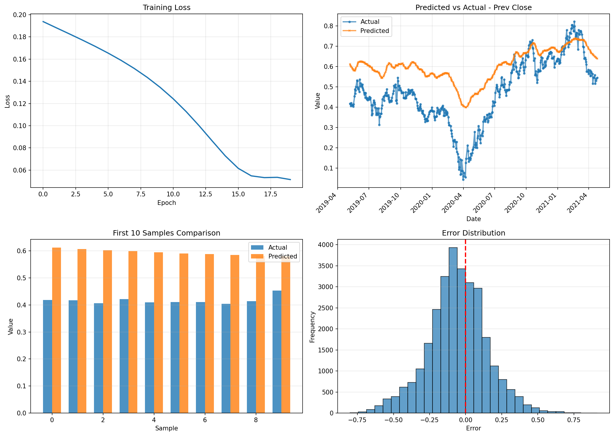

# Multi-Output Stock Forecasting with LSTM

LSTM-based time series forecasting for stock market predictions.

**Input:** Last 10 days of 12 stock features  
**Output:** Next 5 days predictions (all 12 features)

## Dataset
[NIFTY-50 Stock Market Data](https://www.kaggle.com/datasets/rohanrao/nifty50-stock-market-data/) (2000-2021)

## Model Architecture
- **LSTM**: 64 hidden units, 2 layers
- **FC Layer**: Maps LSTM output to future predictions
- **Loss**: MSE
- **Optimizer**: Adam (lr=0.001)
- **Training**: 20 epochs

## Results

### Metrics
- **MSE**: 0.0449
- **RMSE**: 0.2120
- **MAE**: 0.1634

### Plots


Four visualizations:
1. **Training Loss** - Shows decreasing loss over epochs
2. **Date-wise Predictions** - Actual vs Predicted with dates
3. **Sample Comparison** - First 10 test samples side-by-side
4. **Error Distribution** - Histogram of prediction errors

## Usage

### Install dependencies
```bash
pip install pandas numpy scikit-learn torch matplotlib
```

### Train model
```bash
python main.py
```
Generates `plots/forecasting_results.png` and `models/lstm_forecaster.pth`

### Make predictions
```bash
python predict.py
```
Predicts next 5 days and saves to `plots/predictions.csv`

## Project Structure
```
src/
  data.py       → Load, normalize, sequence creation
  model.py      → LSTM model
  train.py      → Training loop
  evaluate.py   → Metrics & visualization
predict.py      → Inference script
main.py         → Pipeline orchestration
```
